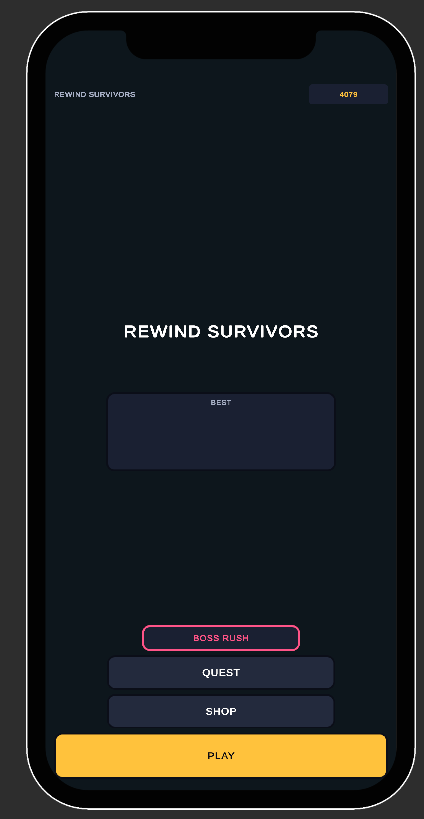
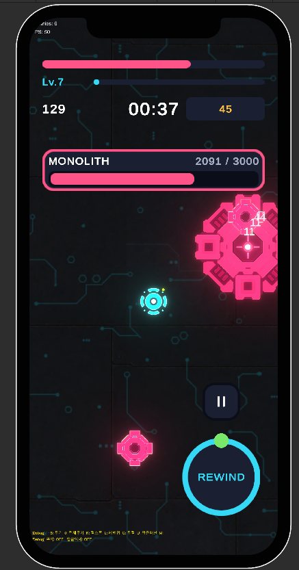
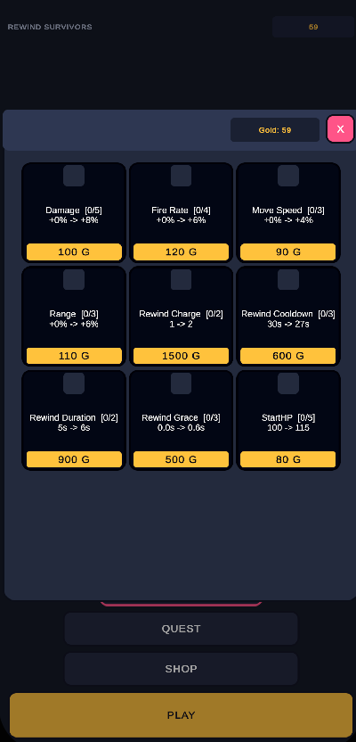
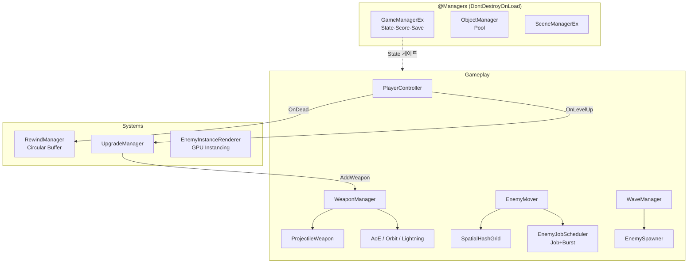

# Rewind Survivors

시간을 되돌려 죽음마저 되감는 탑다운 2D 서바이버. 탕탕특공대 스타일에 시간 되돌리기를 더한 1인 개발 포트폴리오.

**▶ [브라우저에서 바로 플레이](https://rg7155.github.io/26UnityProject/)** · **[플레이 영상 (59초)](https://youtu.be/6QzcW7mtfzc)**

  

Unity 6 · URP · C# (New Input System) — 클라이언트 게임플레이 프로그래머 포트폴리오

---

## 한눈에

- 시간 되돌리기 — 최근 5초를 되감아 위기 탈출, 사망 시 1회 자동 부활
- 다중 무기 서바이버 — 레벨업으로 무기를 모아 동시 발사 (데이터 주도, 에셋만으로 무기 추가)
- 대규모 군중 — 2000마리 동시 처리 (Job System + Burst + GPU Instancing)
- 측정 기반 최적화 — 추측이 아니라 Profiler 수치로 병목을 잡고 개선

이 프로젝트의 목표는 겉보기 완성도가 아니라, 게임플레이 프로그래밍의 핵심 역량(상태 관리, 최적화, 확장 가능한 시스템 설계)을 실제로 구현해 증명하는 것이다.

---

## 기술 하이라이트

### 1. Time Rewind — 풀링과 되감기의 충돌을 푼 스냅샷 시스템

매 0.05초 상태를 Circular Buffer(고정 메모리)에 기록하고, 되감기 시 역재생과 Lerp 보간으로 복원한다.

가장 어려운 지점은 Object Pool과의 충돌이었다. 풀에서 재사용된 적은 같은 오브젝트여도 다른 적일 수 있어, 참조만으로는 동일성을 판별할 수 없다.

해결: 적마다 고유 EntityId를 부여하고, 되감기 시 3-케이스 diff(살아있음 / 부활 / 되감기 구간 중 스폰되어 제거)로 풀 상태를 정확히 복원한다. 풀 재사용 케이스는 ForceRestore로 ID를 강제 주입한다.

상세: [아키텍처.md](아키텍처.md)

### 2. 측정 기반 성능 최적화 — Separation Steering 병렬화

1000마리에서 적끼리 밀어내기(Separation)가 PlayerLoop의 88%를 차지하는 병목을 Profiler로 특정한 뒤, IJobParallelFor와 BurstCompile로 워커 스레드에 분산했다.

| 적 수 | Before | After | Separation 비용 |
|------|--------|-------|----------------|
| 1000 | < 10 FPS | ~200 FPS | 79ms → 0.6ms |
| 2000 | 측정 불가 | ~40 FPS | → 1.6ms |

최적화했다가 아니라 측정하고 최적화했다. ProfilerMarker로 핫패스를 수치화한 뒤 개선했다.

> 위 수치는 **에디터(멀티스레드) 측정값**이다. 웹 빌드는 Job System이 단일 스레드로 동작해
> 동일 수치가 나오지 않는다. 웹 데모에서 대규모 군중을 확인하려면 `F1`(계측 표시) 후
> `K`(적 100마리 즉시 스폰)를 반복하면 된다.

### 3. 데이터 주도 무기 시스템 — 에셋만으로 무기 추가

WeaponData(추상 ScriptableObject)를 타입별로 상속하고, 팩토리 메서드(AddTo)로 WeaponManager가 무기 종류를 몰라도 데이터로 무기를 생성·장착한다.

- 데이터 변형(RapidShot 등): 코드 0줄, 에셋만 추가
- 신규 행동(Orbit 회전 위성, Lightning 연쇄 번개): WeaponBase 서브클래스 1개
- 런타임 스탯은 SO에서 복사해 사용(에셋 오염 방지), 스탯 업그레이드는 전체 무기에 누적 적용

Lightning은 SpatialHash로 인근 적을 연쇄 탐색하고, LineRenderer 절차적 지그재그 볼트로 표현한다. 아트 에셋 0개.

### 4. 대규모 적 처리 파이프라인

| 기법 | 역할 |
|------|------|
| Spatial Hashing | 탐색·범위 판정 근접 쿼리 — 무기 타겟팅 / AoE / 연쇄 |
| GPU Instancing | DrawMeshInstanced — 적 N마리를 타입별 Draw Call 1회 |
| Object Pool | 적·발사체 재사용, GC 압박 제거 |
| Job System + Burst | Separation 병렬화 (위 참고) |

---

## 아키텍처 개요

시스템별 상세(상태 흐름, 되감기 diff, 웨이브, 업그레이드)는 [아키텍처.md](아키텍처.md) 참고.

---

## 개발 프로세스 — AI 증강 워크플로

AI 페어 프로그래밍으로 구현하되, 아키텍처와 설계 결정, 개발 프로세스 자체를 직접 설계했다. AI는 구현 도구이고 설계자는 사람이다.

- AGENTS.md (프로젝트 규약 명세): 네이밍 컨벤션, 참조 규칙(씬 간 코드 / 프리팹 내부 Inspector), 금지 패턴(DI, 과도한 추상화), 복잡한 기능은 단계별 구현 원칙을 문서로 고정했다. 규칙·역할·스킬의 단일 원본을 `AGENTS.md`/`.agents/`에 두고, Claude Code와 Codex는 각 도구 형식의 얇은 어댑터로만 연결해 여러 AI 도구가 같은 규약을 공유하게 했다.
- Unity Dev 오케스트레이터 (다단계 품질 파이프라인): 기능마다 Planner(계획) → Coder(구현) → Reviewer(규약·로직 검증)를 거치는 파이프라인을 구축했다.
- Knowledge Base (재발 방지 지식 자산): 버그를 고칠 때마다 "증상 → 근본 원인 → 재인식 패턴"을 [.claude/knowledge/](.claude/knowledge/README.md)에 축적하고, 새 문제는 착수 전 이 KB를 먼저 검색해 유사 패턴을 재사용한다. LLM이 매 세션 잃는 기억을 외부화한 것이다.
- 핵심 설계 판단(Job System 도입, Rewind의 EntityId diff, 무기 SO 상속 구조, 단계적 분할)은 직접 내리고 AI에 검증·구현을 위임했다.

즉 AI가 게임을 만들었다가 아니라, 엔지니어링 의사결정과 품질 게이트를 갖춘 개발 프로세스를 설계하고 운영했다.

---

## 실행 방법

1. Unity 6으로 프로젝트를 연다 (URP)
2. `Assets/Scenes/Title.unity`에서 Play

## 디버그 키 (웹 데모 포함)

빠른 반복과 데모 시연을 위한 도구. 포트폴리오 특성상 **릴리스 빌드에도 포함**되어 있어 위 웹 링크에서 그대로 쓸 수 있다. 계측 오버레이는 기본 꺼짐이라 일반 플레이는 방해받지 않는다.

| 키 | 동작 |
|----|------|
| F1 | 계측 오버레이 토글 (적 수 · FPS) |
| 1~5 / 0 | 무기 즉시 획득 / 전체 |
| K | 적 100마리 즉시 스폰 (3종 혼합) |
| L | 강제 레벨업 |
| G | 무적 토글 |
| U | 업그레이드 패널 억제 토글 |
| M | 골드 추가 (즉시 저장) |
| T | 보물상자 소환 |

---

## 기술 스택

Unity 6 · URP · C# · New Input System (Polling) · Unity Job System · Burst Compiler · Unity.Mathematics

## 문서

- [아키텍처.md](아키텍처.md) — 시스템별 상세 설계
- [개발_진행상황.md](개발_진행상황.md) — 개발 진행 기록
- [.claude/knowledge/](.claude/knowledge/README.md) — AI가 참조하는 문제해결 Knowledge Base
